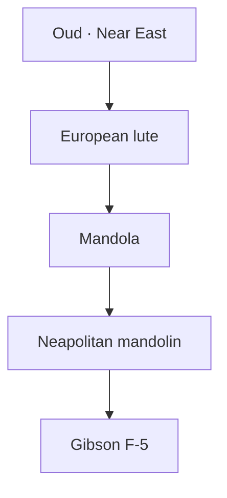

# The lute family at a glance

```mermaid
flowchart TD
  Oud["Oud · Near East"] --> Lute["European lute"]
  Lute --> Mandola["Mandola"]
  Mandola --> Neapolitan["Neapolitan mandolin"]
  Neapolitan --> Gibson["Gibson F-5"]
```
